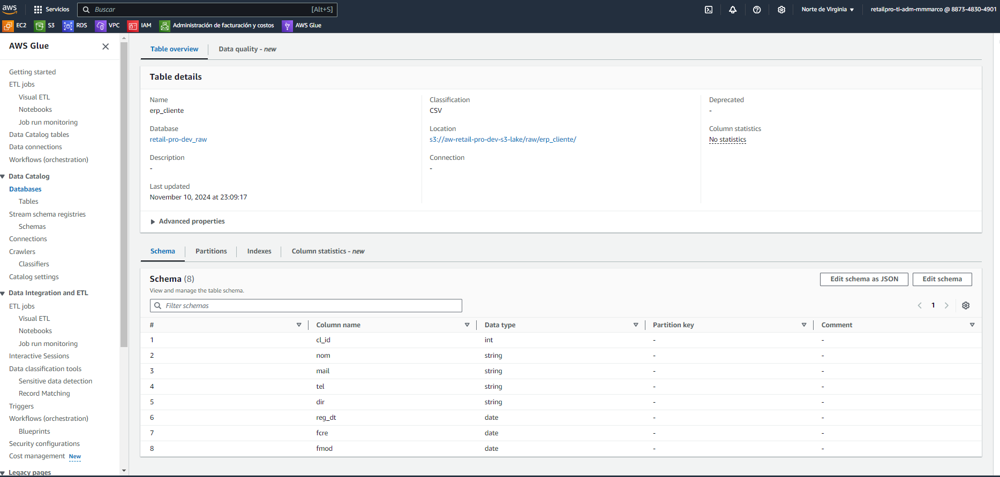
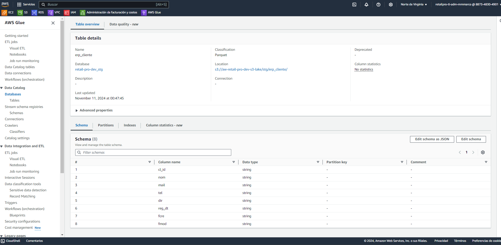
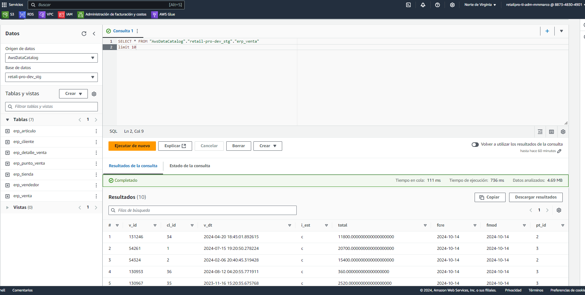
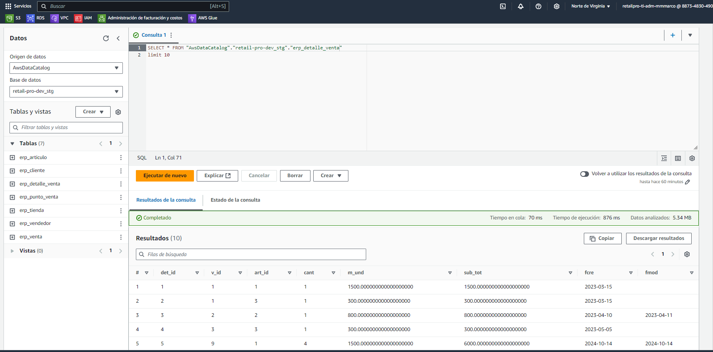
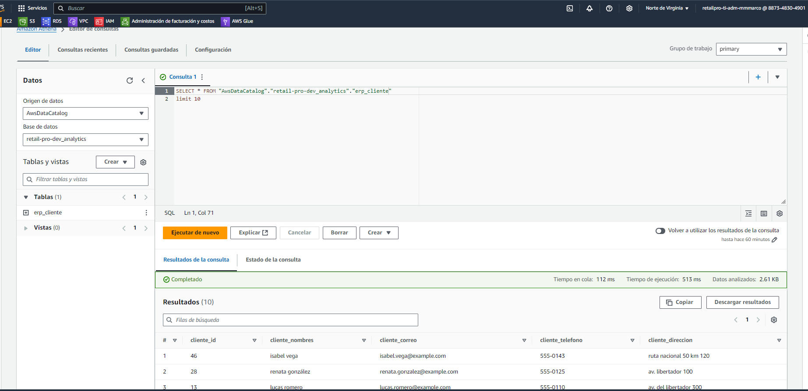
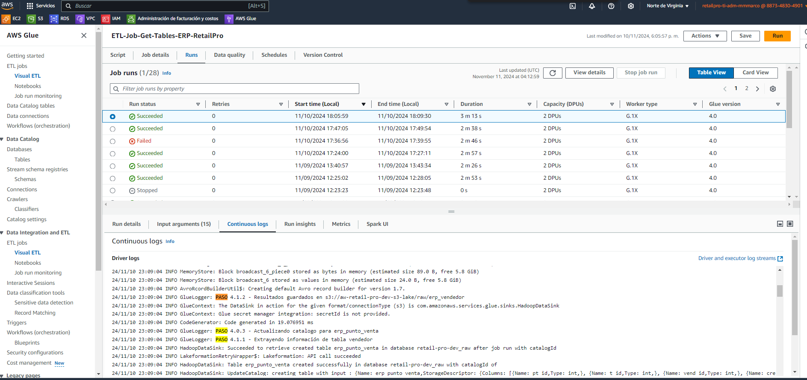

# PROYECTO FINAL INGENIERÍA DE DATOS

Proyecto final desarrollado en AWS - Ingeniería de datos en DMC. En este repositorio encuentra, principalmente, los script implementados en AWS glue (python con pyspark).

## Evidencia AWS Data Catalog Capa Raw y Stage

`Imagen de Tabla erp cliente - Capa Raw - Data Catalog RAW (los tipos de datos no han sufrido ninguna transformación)`

`Imagen de Tabla erp cliente - Capa Stage - Data Catalog Stage (los tipos de datos han sido convertidos a string)`

## Pruebas de consultas interactivas realizadas en AWS Athena - Capa Stage y Analytic

`Imagen de consulta en AWS Athena a la capa Stage - Tabla venta`

`Imagen de consulta en AWS Athena a la capa Stage - Tabla detalle venta`

`Imagen de consulta en AWS Athena a la capa Analytics - Tabla cliente`

### Logs de las ETL:

`Imágen de evidencia de los logs de la etl que obtiene las tablas del esquema erp y las almacena en el datacatalog de glue - Capa raw`

`Imágen de evidencia de los logs de la etl que obtiene las tablas la capa raw, realiza transformaciones básicas y las almacena en el data cataglog de glue - Capa stg`
